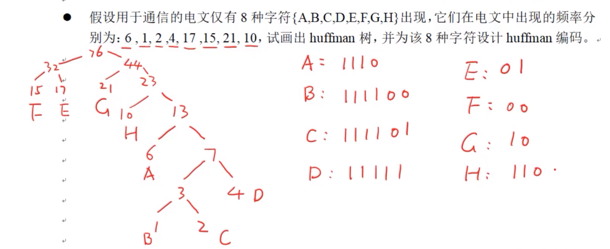
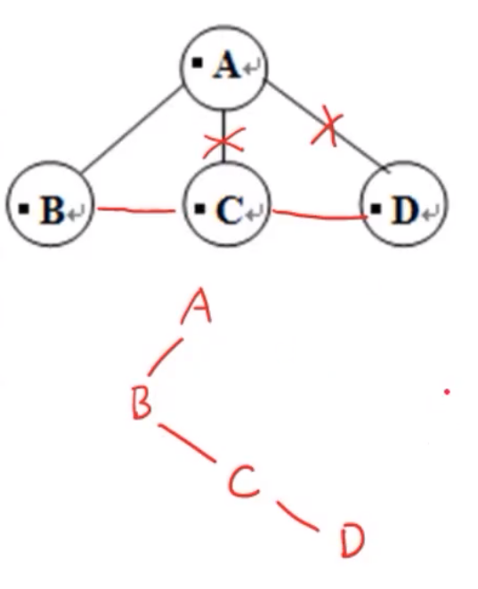
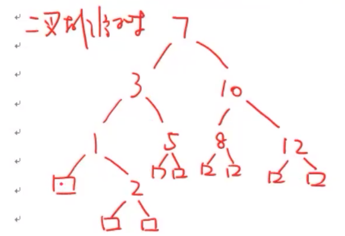
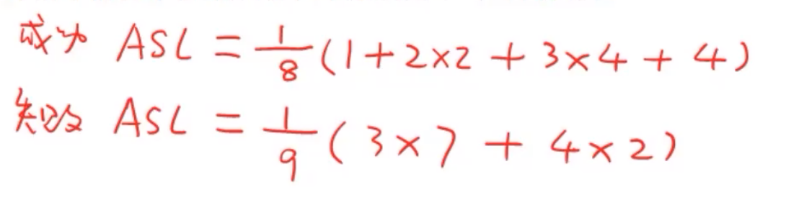
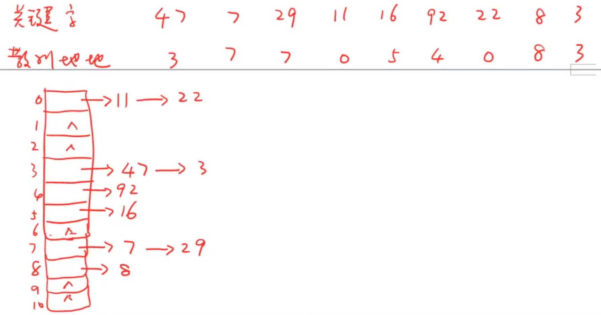
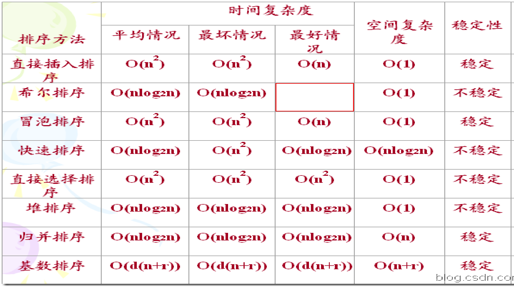

# 重点--习题课

## 时间复杂度

时间复杂度就是调用次数，

重点判断看循环，

还要观察循环中的条件，条件不同时间复杂度可能不同

多重循环就相乘，循环并行就相加（一般取复杂度较高的）

写出是如何变化的，例

```
int i = 2;
while(i<=n)
	i=i*2;
```

分析
$$
执行x次，i为2^x，代入条件中得2^x<=n,x<=log_2 n,所以时间复杂度为O(log_2 n)
$$

```
int i=0,s=0;
while(s<=n)
{
	i++;
	s=s+i;
}
```

分析
$$
执行x次，s=1+2+3+...+x,
代入条件得1+2+3...+x<=n,
即(1+x)x<=2n,
计算得出x<=\sqrt{2n+ \frac 14 } - \frac 12,
所以复杂度为O(\sqrt n)
$$

注意：

- 时间复杂度为O(1)，并不是要求函数内部不能含有循环，而是要求循环的次数为常数次，与n无关。

- 表示时间和空间复杂度时，log表示以2为底的对数

- 递归算法的时间复杂度 = 递归的次数 \* 每次递归函数中的次数

## 空间复杂度

**空间复杂度算的是变量的个数**

常数个额外空间（即常数个变量），空间复杂度为O(1) 

阶乘递归函数会依次调用Factorial(N),Factorial(N-1),…,Factorial(2),Factorial(1)，开辟了N个空间，所以空间复杂度为O(N) 

注意：

- 递归算法的空间复杂度通常是递归的深度（即递归多少层）

## 线性结构

### 线性表

#### [顺序表](顺序表.md)

#### [单链表](单链表.md)

### [栈（先进后出）](栈.md)

### [队列（先进先出）](队列.md)

### [二叉树](二叉树.md)

- 创建空的（）
- 判断是否()是空的
- 插入元素
- 删除元素
- 其他


## 哈夫曼树

每次选择最小的两个，将两个的和加入选择的行列之中，直到选择的行列之中没有元素。

### 哈夫曼编码（二进制编码）

左子树为0，右子树为1



## 二叉树的遍历

### 先序遍历（第一个为根节点）

根-左子树-右子树

### 中序遍历

左子树-根-右子树

### 后序遍历（最后一个为根节点）

左子树-右子树-根

（要求：从二叉树写出不同的序列、从不同的序列画出二叉树）

根据不同遍历方式的特点，将序列划分成互不相交的子集，在子集中找根和左右子树

## 森林转换成二叉树

先把每棵树转换成二叉树，再把每棵树的根作为子树把它连起来

### 树转换成二叉树

兄弟之间先连线，只保留最左边孩子的连线，旋转45°



最后把每个二叉树的根当作兄弟连起来，然后旋转45°，就成功把森林转化成二叉树啦

## 二叉树转化成森林

把所有右节点都断开，然后和第一个左结点的父节点连接起来

## 字典

### 二叉排序树

#### 方法


#### 计算成功ASL和失败ASL（等概率事件）

$$
x_i表示第i层元素，元素个数为n
$$

$$
成功ASL= \frac {1} {n} \sum_{i=1}^{n} {x_i×i}
$$

失败节点的寻找：就是在叶节点上补充形成完全二叉树，补充的节点个数即为失败节点的寻找，例：



有九个框框，代表有九个失败节点
$$
失败节点为x，比较i次发现失败的失败节点个数为y_i
$$

$$
失败ASL= \frac {1} {x} \sum_{i=1}^{n} {y_i×i}
$$


#### 构造最佳二叉排序树

先排序，选中间的作为根，这样左右两边平衡（二分的情况），提高检索效率

### 散列表

- 用散列函数计算散列地址

| 关键字   | （关键字序列的元素i）          |
| -------- | ------------------------------ |
| 散列地址 | （元素通过散列函数得到的值xi） |

#### 线性探查法

- 构建散列表

通过散列长度t或散列因子a来确定下标

散列因子a=元素个数n/哈希表长度t

下标：0~（表长度t-1）

| 下标           | 0    | ...                                                          | t    |
| -------------- | ---- | ------------------------------------------------------------ | ---- |
| 关键字         | x0   | (根据上面计算出的散列地址进行存放，如果位置已有其余元素，则位置往后遍历，直到找到空位存放为止) | xi   |
| 成功的比较次数 | ...  | (与散列地址的差值)                                           | ...  |
| 失败的比较次数 | ...  | (元素比较到空位（无元素）的次数)（空位也算一次）             | ...  |

对于失败的比较次数，例：

| 下标   | 0    | 1    | 2    |
| ------ | ---- | ---- | ---- |
| 关键字 | 11   | 22   | 空   |

对于0来说，比较到空位2的次数为3次（位置：0，1，2）

失败的比较次数只写到下标为（散列函数中的mod值）-1处即可
$$
成功ASL= \frac {1} {n（元素个数）} \sum_{i=1}^{n} {成功的比较次数}
$$

$$
失败ASL= \frac {1} {b（散列函数中的mod值）} \sum_{i=1}^{n} {失败的比较次数}
$$

#### 拉链法

- 构建单链表

散列函数中的mod值即为单链表的个数

插入：头插法或尾插法都可以

例：


$$
链表后第i位的元素个数xi
$$

$$
成功ASL=\frac {1} {n（元素个数）} \sum_{i=1}^{n} {xi×i}
$$

$$
失败ASL=\frac {元素个数} {散列函数的mod值}
$$

## [图](图.md)

### 最小生成树

#### prim算法

每次循环选择一个顶点（和一条边）加入到最小生成树中，直到把所有顶点全部在最小生成树

从顶点的集合V里取一个顶点v放入集合U中，在一个顶点在U，一个顶点在V的边里面找权最小的边，然后将在V集合里关于那条边的顶点加入U中，重复上述操作直到V=U为止。

#### kruskal算法（无顶点）

初始状态是只有n个顶点而无边的非连通图，每个顶点自成为一个连通子图，将所有边的集合E按权递增排序排列，选择顶点分别在两个连通图中且权最小的边加入图T，原来两个连通图由于边的连接成为一个连通子图。重复选择，直到所有顶点都在同一个连通子图上为止。

注意：边不能闭合，即：若选择v1到v2，v2到v3，就不能选择v1到v3

### 最短路径

#### Dijkstra算法

例：


## [排序](排序方法.md)



