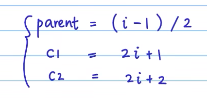

## 完全二叉树

顺序排到和广度优先遍历一样就是完全二叉树

可以用数组的下标来找到一个节点的父节点和子节点

i为二叉树的某个节点，则：




## 二叉树创建和遍历

```
#include <iostream>
using namespace std;

typedef char DataType;

//二叉树数据结构 
struct node
{
	DataType info; //存放结点数据 
	struct node *lchild, *rchild; //指向左右孩子的指针 
};

typedef struct node *BiTree ;

/*创建二叉树
  函数名：createBiTree
  参数：无
  返回值：二叉树根结点指针
  */
BiTree createBiTree(void)
{
	//请在此处填写代码， 完成二叉树和创建，返回值是二叉树的根结点指针
    /********** Begin **********/
    DataType ch;
    BiTree t;
    scanf("%c",&ch);
    if(ch=='#')
        t=NULL;
    else
    {
        t = (BiTree)malloc(sizeof(struct node));
        t->info=ch;
        t->lchild=createBiTree();
        t->rchild=createBiTree();
    }
    return t;
    
    /********** End *********/
}

void visit(BiTree T) //输出结点T的数据
{
	cout<<T->info ;
}

void inOrder(BiTree root)
{
	if(root == NULL) return ;
	inOrder(root->lchild);
	visit(root);
	inOrder(root->rchild);
}

int main(void)
{
	BiTree root = createBiTree();
	inOrder(root);
}
```

## 计算二叉树中叶子的个数

```
#include <iostream>
using namespace std;

typedef char DataType;

//二叉树数据结构 
struct node
{
	DataType info ; //存放结点数据 
	struct node *lchild , *rchild ; //指向左右孩子的指针 
};

typedef struct node *BiTree ;

/*创建二叉树
  函数名：createBiTree
  参数：无
  返回值：二叉树根结点指针
  */
BiTree createBiTree(void)
{
	char ch ;
	BiTree  root ;
	cin>>ch ;
	if(ch == '#') root = NULL;
	else{
        root = new struct node ;
        root->info = ch ;
        root->lchild = createBiTree() ;
        root->rchild = createBiTree();
	}
	return root ;
}

void visit(BiTree T)
{
	cout<<T->info ;
}

int countLeaf(BiTree root)
{
    //请在此处填写代码， 计算二叉树中树叶的个数
    /********** Begin **********/
    if(root)
    {
        if(root->lchild==NULL&&root->rchild==NULL)
            return 1+countLeaf(root->lchild)+countLeaf(root->rchild);
        else
            return countLeaf(root->lchild)+countLeaf(root->rchild);
    }
    else 
        return 0;

    /********** End **********/
}

int main(void)
{
	BiTree root = createBiTree();
	cout<<countLeaf(root);
}
```

## 实现二叉树左右子树互换

```
#include <iostream>
using namespace std;

typedef char DataType;

//二叉树数据结构 
struct node
{
	DataType info ; //存放结点数据 
	struct node *lchild , *rchild ; //指向左右孩子的指针 
};

typedef struct node *BiTree ;

/*创建二叉树
  函数名：createBiTree
  参数：无
  返回值：二叉树根结点指针
  */
BiTree createBiTree(void)
{
	char ch ;
	BiTree  root ;
	cin>>ch ;
	if(ch == '#') root = NULL;
	else{
        root = new struct node ;
        root->info = ch ;
        root->lchild = createBiTree() ;
        root->rchild = createBiTree();
	}
	return root ;
}

void changeLR(BiTree bt)
{
	//请在此处填写代码， 完成二叉树左右子树互换 
    /********** Begin **********/
    if(bt->lchild==NULL&&bt->rchild==NULL)
		;
	else    //三种情况，1.都不为空，2.左为空，3.右为空；
	{
		//交换左右子树；
		BiTree temp=bt->lchild;
		bt->lchild=bt->rchild;
		bt->rchild=temp;
	}
 
	//如果交换后的这个结点左子树不为空，则继续向下寻找可以交换的结点；
	if(bt->lchild)    		
		changeLR(bt->lchild);
	if(bt->rchild)
		changeLR(bt->rchild);
    
    /********** End **********/
}

void visit(BiTree T) //输出结点T的数据
{
	cout<<T->info ;
}

void inOrder(BiTree root)
{
	if(root == NULL) return ;
	inOrder(root->lchild);
	visit(root);
	inOrder(root->rchild);
}

int main(void)
{
	BiTree root = createBiTree();
    changeLR(root);
	inOrder(root);
}
```

## 计算二叉树中有两个孩子的结点个数

```
#include <iostream>
using namespace std;

typedef char DataType;

//二叉树数据结构 
struct node
{
	DataType info ; //存放结点数据 
	struct node *lchild , *rchild ; //指向左右孩子的指针 
};

typedef struct node *BiTree ;

/*创建二叉树
  函数名：createBiTree
  参数：无
  返回值：二叉树根结点指针
  */
BiTree createBiTree(void)
{
	char ch ;
	BiTree  root ;
	cin>>ch ;
	if(ch == '#') root = NULL;
	else{
        root = new struct node ;
        root->info = ch ;
        root->lchild = createBiTree() ;
        root->rchild = createBiTree();
	}
	return root ;
}

void visit(BiTree T)
{
	cout<<T->info ;
}

int countFullNode(BiTree root)
{
	//请在此处填写代码，计算二叉树中满结点的个数
    /********** Begin **********/
    if(root)
    {
        if(root->lchild&&root->rchild)
            return 1+countFullNode(root->lchild)+countFullNode(root->rchild);
        else
            return countFullNode(root->lchild)+countFullNode(root->rchild);
    }
    else
        return 0;
    
    /*********** End-**********/
}

int main(void)
{
	BiTree root = createBiTree();
	cout<<countFullNode(root) ;
}
```

## 关于二叉树的计算

完全二叉树的高度计算

叶节点与度为2的节点关系：
$$
n_0=n_2+1
$$
完全二叉树第i层有n个节点，求叶节点

高度为k的二叉树其结点数至少k+1个（根高度为0）


1. 
   $$
   二叉树中，第 i 层最多有2^{i-1}个结点
   $$

2. 

$$
如果二叉树的深度为 K，那么此二叉树最多有 2^K-1 个结点。
$$

满二叉树（度为0或2）：

1. 满二叉树中第 i 层的节点数为 2n-1 个。
2. 深度为 k 的满二叉树必有 2k-1 个节点 ，叶子数为 2k-1。
3. 满二叉树中不存在度为 1 的节点，每一个分支点中都两棵深度相同的子树，且叶子节点都在最底层。
4. 具有 n 个节点的满二叉树的深度为 log2(n+1)。


