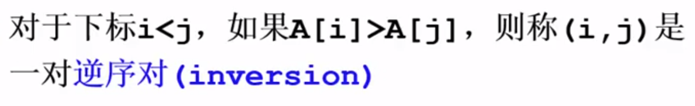
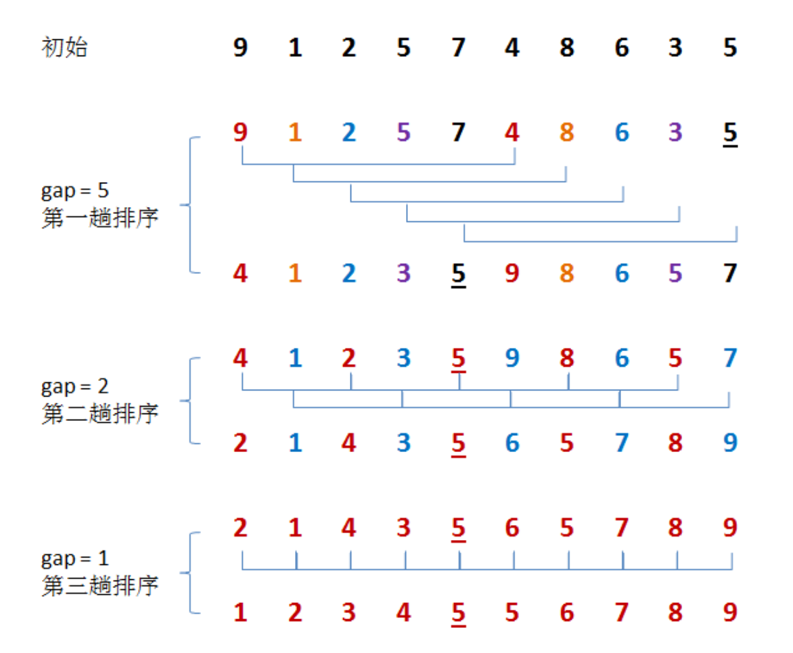

# [排序方法](https://github.com/hustcc/JS-Sorting-Algorithm)

## 简单排序

### 冒泡排序


思想：（若是上小下大）

i趟排序：从上到下第一个到n-i+1个比较两个相邻的元素，如果上面的元素大于下面的元素，就交换顺序

改进：如果在中途就排好序了，当在一趟排序中没有元素交换说明排好序了，用一个标识符标志出来

```
void Bubble_Sort(ElemenyType A[],int N)
{
	for(P=N-1;P>=0;P--)
	{
		flag=0;//标识
		for(i=0;i<P;i++)
		{
			if(A[i]>A[i+1])
			{
				swap(A[i],A[i+1]);
				flag=1;//标识发生改变
			}
		}
		if(flag==0)
			break;//一趟排序后没有元素发生交换
	}
}
```

好处：可以排序数组，还有单链表；稳定

### [插入排序](runoob.com/w3cnote/insertion-sort.html)


思想：有两个序列，一个已排序，一个未排序，**在未排序中选元素，然后与已排序的序列从后往前的进行对比，放进合适的位置**，重复上述步骤直到未排序中没有元素。


先取一个元素进来，后续就是取元素进来，然后比较，如果比最后一个元素大，则放在最后一个元素后面；如果小，则最后一个元素后移一位，重复上述过程直到上一个元素比此元素小，就放入空位中。

```
void Insertion_Sort(ElementType A[],int N)
{
	for(P=1;P<N;P++)//默认已有一张牌
	{
		Tmp = A[P];//摸下一张牌
		for(i=P;i>0&&A[i-1]>Tmp;i--)
			A[i]=A[i-1];//移出空位
		A[i]=Tmp;//新牌的位置
	}
}
```

优点：稳定

### 时间复杂度下界



交换2个相邻元素正好消去1个逆序对。

每次消去不止一个逆序对会提高效率

## 希尔排序



希尔排序的基本思想是：先将整个待排序的记录序列分割成为若干子序列分别进行直接插入排序，待整个序列中的记录"基本有序"时，再对全体记录进行依次直接插入排序。 

思想：先对序列进行n间隔的排序（间隔n个元素取元素然后比较大小并进行插入排序）然后不断减小n重复下去，直到n减小到1

有一个特性：当进行n减小的排序后，原来的n排序仍然是有序的

增量序列互质比较有效,不会浪费有效次数

```
void shellSort(int *a, int len)
{
    int i, j, k, tmp, gap;  // gap 为步长
    for (gap = len / 2; gap > 0; gap /= 2) {  // 步长初始化为数组长度的一半，每次遍历后步长减半
    	for (i = 0; i < gap; ++i) { // 变量 i 为每次分组的第一个元素下标 
	        for (j = i + gap; j < len; j += gap) { //对步长为gap的元素进行直插排序，当gap为1时，就是直插排序
	            tmp = a[j];  // 备份a[j]的值
	            k = j - gap;  // k初始化为i的前一个元素（与i相差gap长度）
	            while (k >= 0 && a[k] > tmp) {
	                a[k + gap] = a[k]; // 将在a[i]前且比tmp的值大的元素向后移动一位
	                k -= gap;
	            }
	            a[k + gap] = tmp; 
	        }
	    }
    }
}
```


## 选择排序


思想：分成两个部分，一个是已排序，一个是未排序，从未排序部分找到最大或者最小元素，放进已排序的序列末尾，这一步也可以说是**已排序序列后的那个元素和最大或最小元素互换位置**，重复上述步骤

```
void swap(ElementType *a,ElementType *b)
{
	ElementType temp=*a;
	*a=*b;
	*b=temp;
}

void Selection_Sort(ElementType A[],int N)//假设从小到大排序
{
	for(int i=0;i<N-1;i++)
	{
		ElementType min=A[i];
		for(int j=i+1;j<N-1;j++)
		{
			if(A[j]<A[i])
			{
				min=j;
			}
		}
		swap(&A[min],&a[i]);
	}
}
```

## 归并排序


思想：先申请空间，设置空间大小为已排序序列之和，用来存放合并后的序列；然后设定两个指针分别指向两个已经排序序列的起始位置；比较两个指针所指的元素，选择较小的放进合并空间中，并移动指针到下一位置。重复比较过程直到某一指针达到序列尾，将另一序列剩下的所有元素都放进序列尾。

```
int min(int x,int y)//比较较小值
{
	if(x<y)
		return x;
	else
		return y;
	//return x<y?x:y;(条件)
}

void merge_sort(int A[],int N)
{
	int *a=A;//动图上部分，相当于一个指针指向它本身
	int *b=(int*)malloc(N*sizeof(int));//动图下部分，申请一个等大的空间用来排序
	int seg,start;
	for(seg=1;seg<N;seg+=seg)//如何切割有序序列，2倍增长
	{
		for(start=0;start<N;start+=seg*2)//两个有序序列，在申请的空间进行排序
		{
			int low=start,mid=min(start+seg,N),high=min(start+seg*2,N);//定边界
			int k=low;
			int start1=low,end1=mid;
			int start2=mid+1,end2=high;
			while(start1<end1&&start2<end2)
				b[k++]=a[start1]<a[start2]?a[start1++]:a[start2++];
			while(start1<end1)
				b[k++]=a[start1++];
			while(start2<end2)
				b[k++]=a[start2++];
		}
		int *temp =a;
		a=b;
		b=temp;
	}
	if(a!=A)//排好序就把申请空间中的元素放进原数组中，再释放空间
	{
		int i;
		for(i=0;i<N;i++)
			b[i]=a[i];
		b=a;
	}
	free(b);
}
```

## [快速排序](https://www.runoob.com/w3cnote/quick-sort-2.html)


实现思路：

- 从待排序序列中任选一个元素（假设为 pivot）作为中间元素（通常会挑选待排序序列中第一个元素或者最后一个元素作为中间元素），将所有比 pivot 小的元素移动到它的左边，所有比 pivot 大的元素移动到它的右边；

  （**以第一个元素为基准，先从后往前找小的，找到之后就换方向，从前往后找大的，重复以上步骤**）

- pivot 左右两边的子序列看作是两个待排序序列，各自重复执行第一步。直至所有的子序列都不可再分（仅包含 1 个元素或者不包含任何元素），整个序列就变成了一个有序序列。


从数列中挑出一个元素，称为 "基准"（pivot）;

重新排序数列，所有元素比基准值小的摆放在基准前面，所有元素比基准值大的摆在基准的后面（相同的数可以到任一边）。在这个分区退出之后，该基准就处于数列的中间位置。这个称为分区（partition）操作；

递归地（recursive）把小于基准值元素的子数列和大于基准值元素的子数列排序；

```
typedef struct _Range{
	int start,end;
}Range;

Range new_Range(int s,int e)
{
	Range r;
	r.start=s;
	r.end=e;
	return r;
}

void swap(int *x,int *y)
{
	int t = *x;
	*x = *y;
	*y = t;
}

void quick_sort(T arr[], const int len) {
    if (len <= 0)
        return; 
    Range r[len];
    int p = 0;
    r[p++] = Range(0, len - 1);
    while (p) {
        Range range = r[--p];
        if (range.start >= range.end)
            continue;
        T mid = arr[range.end];
        int left = range.start, right = range.end - 1;
        while (left < right) {
            while (arr[left] < mid && left < right) left++;
            while (arr[right] >= mid && left < right) right--;
            std::swap(arr[left], arr[right]);
        }
        if (arr[left] >= arr[range.end])
            std::swap(arr[left], arr[range.end]);
        else
            left++;
        r[p++] = Range(range.start, left - 1);
        r[p++] = Range(left + 1, range.end);
    }
}
```

```
//递归算法
void QuickSort(int *arr, int low, int high)  
{
	if (low < high)
	{
		int i = low;
		int j = high;
		int k = arr[low];
		while (i < j)
		{
			while (i < j && arr[j] >= k)     // 从右向左找第一个小于k的数
			{
				j--;
			}
 
			if (i < j)
			{
				arr[i++] = arr[j];
			}
 
			while (i < j && arr[i] < k)      // 从左向右找第一个大于等于k的数
			{
				i++;
			}
 
			if (i < j)
			{
				arr[j--] = arr[i];
			}
		}
 
		arr[i] = k;
 
		// 递归调用
		QuickSort(arr, low, i - 1);     // 排序k左边
		QuickSort(arr, i + 1, high);    // 排序k右边
	}
}
```

## 堆排序


堆：

1.[完全二叉树](二叉树.md) 

2.父节点的值大于子节点的值

构造堆（heapify）：当父节点小于较大子节点时，父节点与较大子节点交换，且判断换过来后的子节点的那棵树是否要交换位置。

如果把一个不知道顺序的二叉树变成一个堆，共有n层，从n-1层开始堆每个节点做heapify。

思想：先把数组中的所有元素按照完全二叉树的顺序构建一个树，然后从下往上heapify直到构建成了一个堆，然后把最上面的父节点与最后一个节点交换顺序，然后把最后一个节点与树断联，然后继续构造堆，继续交换顺序，直到全部都断联，此时数组中顺序就是从小到大的。

（一趟排序：构建堆-->交换元素-->构建堆）

```
void swap(int arr[],int i,int j)
{
	int temp = arr[i];
	arr[i]=arr[j];
	arr[j]=temp;
}

void heapify(int tree[],int n,int i)//n是二叉树中的元素个数
{
	if(i >= n)
		return;
	int c1 = 2*i+1;
	int c2 = 2*i+2;//计算出两个子节点的位置
	int max = i;//假设最大值为父节点
	if(c1 < n && tree[c1] > tree[max]){
		max = c1;
	}
	if(c2 < n && tree[c2] > tree[max]){
		max = c2;
	}
	if(max!=i){
		swap(tree,max,i);
		heapify(tree,n,max);//从上到下
	}
}
//当全是乱序的时候，从最后节点的父节点开始往前遍历,构建一个堆
void build_heap(int tree[],int n)
{
	int last_node=n-1;
	int parent = (last_node-1)/2;
	int i;
	for(i = parent;i >= 0;i--)
	{
		heapify(tree,n,i);
	}	
}
//堆排序
void heap_sort(int tree[],int n)
{
	build_heap(tree,n);
	int i;
	for(i = n-1;;i >= 0;i--)
	{
		swap(tree,i,0);
		heapify(tree,i,0);
	}
}
```

## 基数排序

适用于对多个整数或多个字符串进行升序或降序


思想：创建10个桶，从各位开始遍历，找对应的放进数组，再按顺序排好。

