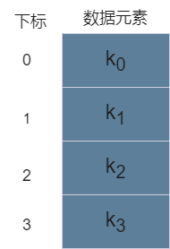

## 线性表

### 基本概念

#### 抽象数据类型

```
List list;
DataType x;
position p;
```

### 顺序表示

顺序表：将线性表中的元素一个接一个地存储在一片相邻的存储区域中

##### 存储结构

```
struct SeqList
{
	int MAXNUM;//最大元素的个数，不可以超出
	int n;//实际上表中元素的个数
	DataType *element;
};
typedef struct SeqList *PSeqList;
```



##### 创建空顺序表

```
PSeqList createNullList_seq(int m)
{
	if(m<=0)
		return;
	PSeqList p=(PSeqList)malloc(sizeof(struct SeqList));//表的空间要放下m个元素
	if(p)//创建成功 
	{
		p->element=(DataType *)malloc(sizeof(DataType)*m);//为每个元素申请空间，以便放下数据
		p->MAXNUM=m;
		p->n=0;//初始状态表中元素为0
		return p;//创建完成 
	}
	else
		free(p);//没创建成功就释放空间 
	return NULL;
}
```

##### 判断线性表是否为空

```
int isNullList_seq(PSeqList p)
{
	//若线性表为空则返回1，否则返回0
	if(p->n==0)
		return 1;
	else
		return 0; 
}
```

##### 在顺序表中求某元素的下标

```
int locate_seq(PSeqList p,DataType x)
{
//直接遍历找有没有这个元素 
	int i;
	for(i=0;i<p->n;i++)
	{
		if(p->element[i]==x)
			return i;
	}
	return -1;
}
```

##### 顺序表的插入

```
int insertPre_seq(SeqList p,int q,DataType x)
{
	//在表p中下标为q的元素之前插入x,后移比较方便 
	if(p->n>=p->MAXNUM)
		return 0;//溢出 
	if(q<0||q>n-1)
		return 0;//位置不合理
	int t;
	for(t=n-1;t>q;t--)
	{
		p->element[t+1]=p->element[t];//全部后移，方便插入 
	}
	p->element[q]=x;
	p->n=p->n+1;//元素个数加一（容易遗漏） 
	return 1;
}
```

##### 顺序表的删除

```
DataType deleteP_seq(PSeqList p,int q)
{
	//删除下标为q的结点并返回删除元素的值,后面的往前移覆盖掉这个数 
	if(q<0||q>n-1)
		return 0;//位置不合理
	int i;
	DataType x=p->element[q];
	for(i=q;i<n-1;i++)
	{
		p->element[i]=p->element[i+1];//小心越界 
	}
	free(p->element[i]);
	p->n=p->n-1;//元素个数减一（容易遗漏）
	return x;
}
```


