# 数电笔记

## 数制与编码

常用数制：二进制、八进制、十进制、十六进制

### 数制转换

#### 10<->2（展开，取余取整）

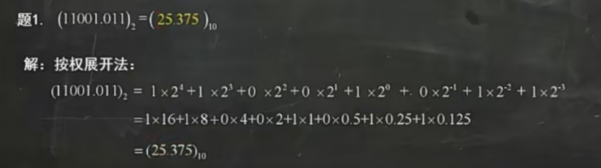

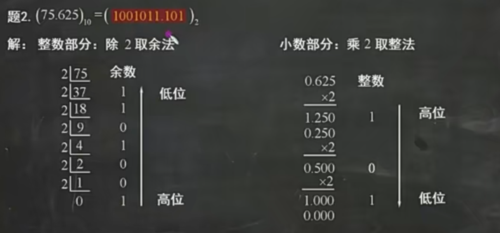

#### 2<->16（四位一体）

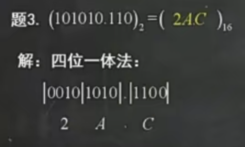

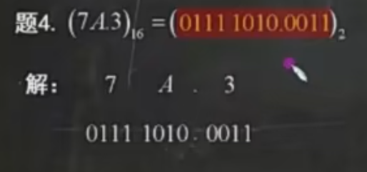

tips：写二进制的时候，每四位就空一点格，方便观察

#### 2<->8（三位一体）

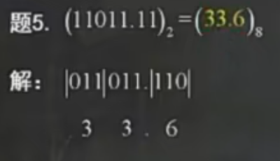

### BCD编码

4位二进制表示一位十进制数（0~9），常用是8421 BCD码

10<->8421 BCD码  == 16<->2   不同之处：A,B,C,D...用9，10，11，12...表示

## 逻辑代数

### 逻辑运算以及逻辑门

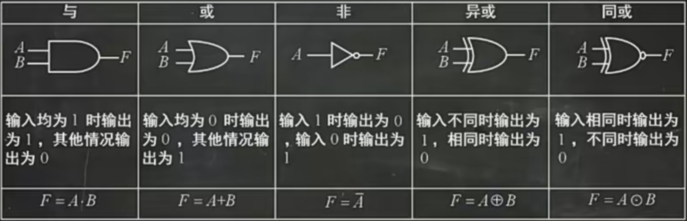

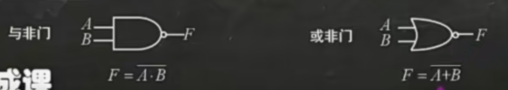

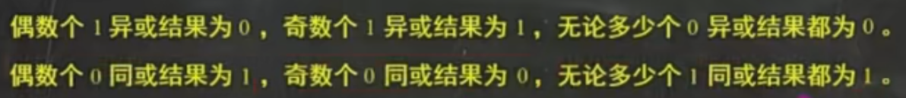

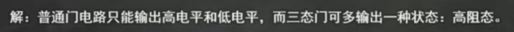

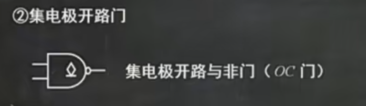

### 规则及常用形式

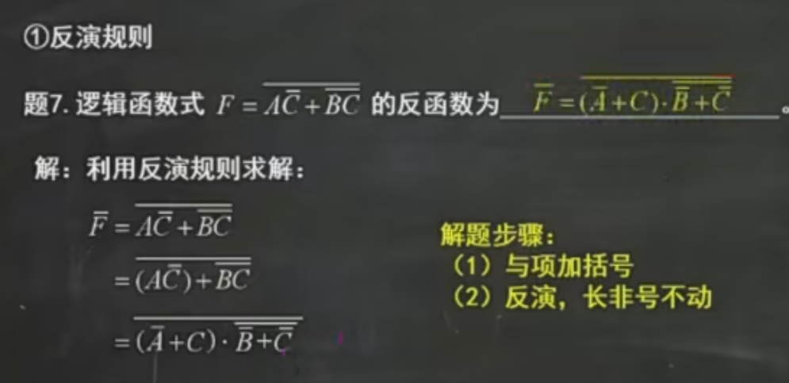

**将其中所有`·` 换成 `+`，`+`换成 `·`，`0`换成 `1`，`1`换成 `0`，原变量换成反变量，反变量换成原变量，得到的结果就是 `Y'`**

运算次序：先括号、然后乘、最后加

不属于单个变量的反号应保留不变

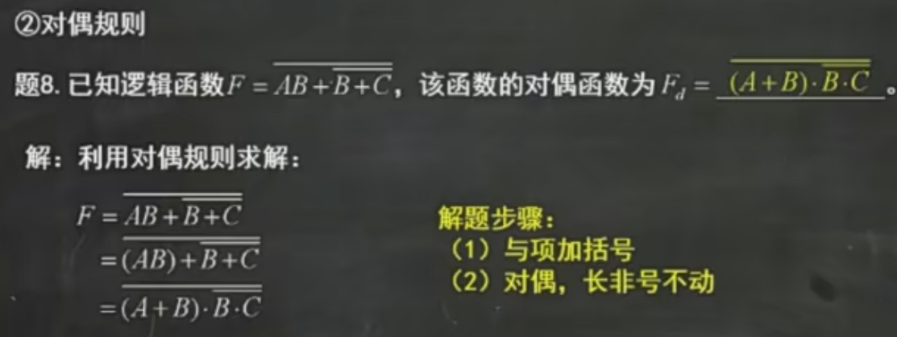

与反演规则不同的是，反变量和原变量之间不用相互转化

## 卡诺图

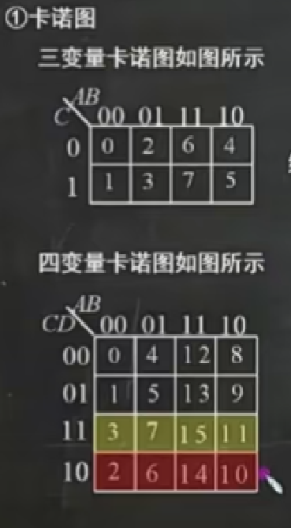

#### 卡诺图的画法

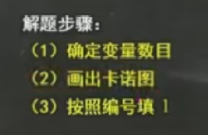

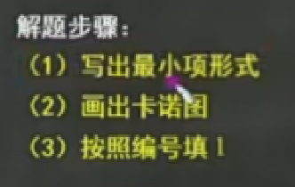

逻辑相邻项：若两个最小项相邻，则二者仅有一个变量不同。

（n变量最小项有n个逻辑相邻项）

### 卡诺图化简逻辑函数

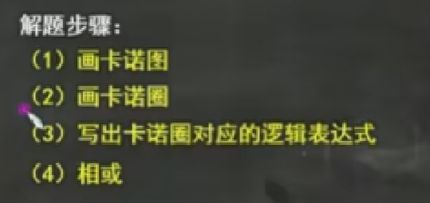

## 译码器

### 3-8译码器

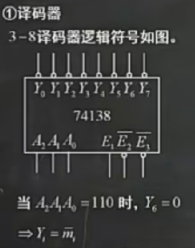

