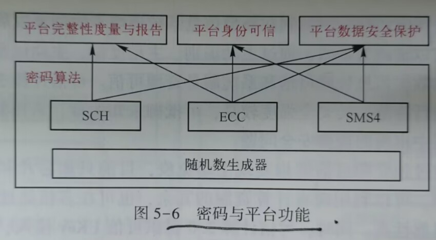
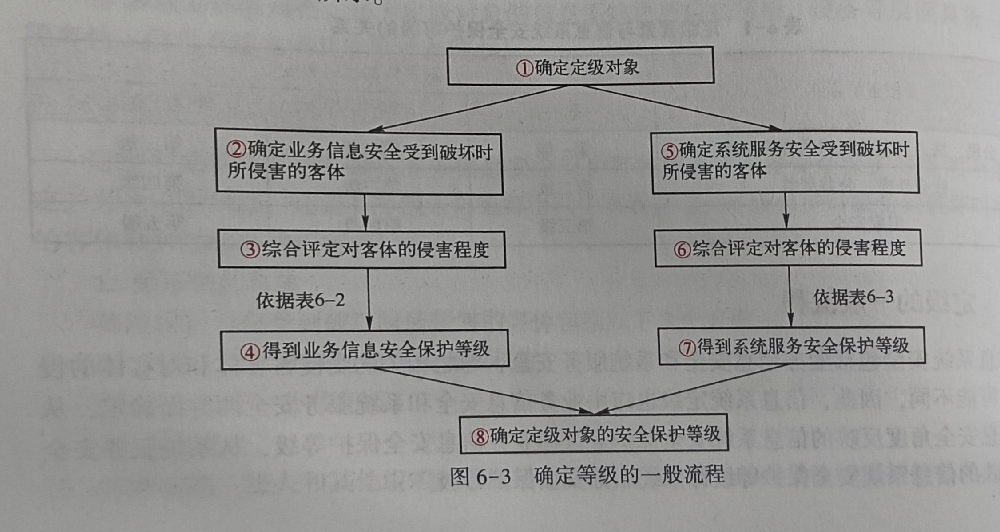

# ·网络空间安全导论

[TOC]

## 第一章

### （1）网络安全的重要性

1.网络安全事关政治安全

2.网络空间安全事关经济安全

3.网络空间安全事关文化安全

4.网络空间安全事关社会安全

5.网络空间安全事关国防安全

### （2）建设网络强国的近期、中期、长期目标

1.近期目标：技术强（有自己的技术，有过硬的技术）、基础强（有良好的信息基础设施，形成实力雄厚的信息经济）、内容强（有丰富全面的信息服务，繁荣发展的网络文化）、人才强（有高素质的网络安全和信息化的人才队伍）、国际话语权强（积极开展双边、多边的互联网国际交流合作）。

2.中期目标：建设网络强国的战略部署和“两个一百年”奋斗目标同步推进，向着网络基础设施基本普及、自主创新能力显著增强、信息经济全面发展、网络安全保障有力的目标不断前进。

3.远期目标：战略清晰，技术先进、产业领先，制网权尽在掌握，网络安全坚不可摧。

### （3）如何树立正确的网络安全观

1.网络安全是整体的而不是割裂的

2.网络安全是动态的而不是静态的

3.网络安全是开放的而不是封闭的

4.网络安全是相对的而不是绝对的

5.网络安全是共同的而不是孤立的

### （4）战略目标

以总体国家安全观为指导，贯彻落实创新、协调、绿色、开放、共享的发展理念，增强风险意识和危机意识，统筹国内、国际两个大局，统筹发展安全两件大事，积极防御、有效应对，推进网络安全和平、安全、开放、合作、有序，维护国家主权、安全、发展利益，实现建设网络强国的战略目标。

### （5）战略原则

1.尊重维护网络空间主权（任何国家都不搞网络霸权、不搞双重标准，不利用网络干涉他国内政，不从事、纵容或支持危害他国国家安全的网络活动）

2.和平利用网络空间（符合人类的共同利益）

3.依法治理网络空间（全面推进网络安全空间法治化，坚持依法治网、依法办网、依法上网）

4.统筹网络空间安全与发展（正确处理发展与安全的关系，坚持以安全保发展，以发展促安全）

### （6）战略任务

1.坚定捍卫网络空间主权

2.坚决维护国家安全

3.保护关键信息基础设施

4.加强网络文化建设

5.打击网络恐怖和违法犯罪

6.完善网络治理体系

7.夯实网络空间安全基础

8.提升网络空间防护能力

9.强化网络空间国际合作

## 第二章 

### （1）网络安全的基本属性

1.保密性，是指信息不被泄露给非授权的用户、实体或过程，或被其利用的特性。包括信息内容的保密和信息状态的保密。

2.完整性，是指信息未经授权不能进行更改的特性。即信息再存储或传输过程中保持不被偶然或蓄意地删除、修改、伪造、乱序、重放、插入等破坏和丢失的特性。

3.可用性，是信息可被授权实体访问并按需求使用的特性。

### （2）安全服务

1.鉴别。鉴别服务提供对通信中的对等实体和数据来源的鉴别，分为对等实体鉴别（为了确保一个实体没有试图冒充别的实体）和数据原发鉴别（对数据的来源进行确认）。

2.访问控制。访问控制服务决定了什么实体可以访问什么资源，以防止非授权的实体访问系统内的资源。

3.数据完整性。数据完整性服务用来对付试图破环、篡改信息资源的主动威胁，从而能够防止或检测信息资源受到篡改等破坏。

4.数据保密性。数据保密性服务是对数据提供保护，使之不被非授权地泄露。

5.抗抵赖。分为原发抗抵赖（数据发送者无法否认其发送数据的事实）和接受抗抵赖（数据接收者事后无法否认其收到过这些数据）。

### （3）安全机制

1.加密机制。为数据以及通信业务流信息提供保密性。

2.数字签名机制。有两个过程：一是签名过程，二是验证签名过程。

3.访问控制机制。为了判断一个实体是否具有访问权，访问控制机制可以使用该实体已鉴别过的身份，或使用有关该实体的信息，或使用该实体已经获得的授权。

4.数据完整性机制。一是单个数据单元或字段的完整性，二是数据单元流或字段流的完整性。

5.鉴别交换机制。通信过程中一方鉴别另一方身份的过程。（例：口令鉴别、数据加密确认）

6.通信业务填充机制。是指在正常通信流中增加冗余的通信，以抵抗通信业务分析。

7.路由选择控制机制。路由能动态地或预设确定，以便使用物理上安全的子网络、中继站或链路。

8.公证机制。指由于第一方和第二方互不相信，于是寻找一个双方都信任的第三方，通过第三方的背书在第一方和第二方之间建立信任。

### （4）安全产品

#### 1.防火墙

功能：访问控制功能、内容控制功能、安全日志功能、集中管理功能、其他附加功能（流量控制功能、NAT（网络地址转换）功能、VPN（虚拟专用网）功能）

局限性：a.不能防范被保护网络内部人员发起的攻击。b.不能防范不经过防火墙的攻击。c.不能完全防止传送已感染病毒的软件或文件。d.不能防范数据驱动型攻击。e.不能防范不断更新的攻击方式。

#### 2.入侵检测系统

功能：监视用户和系统的活动、发现入侵行为、记录和报警

分类：基于主机的入侵检测系统、基于网络的入侵检测系统

局限性：a.不具有访问控制的能力。b.单独使用不能起到保护网络的作用，也不能独立地阻止任何一种攻击。c.对攻击行为不能直接自动处理。

#### 3.恶意代码防护

分类：病毒（传染性、隐蔽性、潜伏性、多态性、破坏性）、蠕虫、特洛伊木马（与病毒区别是不具有传染性）、逻辑炸弹

处置：检测阶段、反应阶段、恢复阶段

## 第三章

### （1）RSA计算

### （2）密码学的发展历史

第一个阶段是从几千年前到1949年，分析密码基于直觉和经验分析。

第二个阶段是从1949年到1975年，密码学成为了一门科学。

第三个阶段是从1976年至今。开创了公钥密码学的新纪元。

### （3）分组密码工作模式

1.电子密码本（ECB）模式  （1个，只会影响自己本身的加密解密）  2.密码分组链接（CBC）模式    （2个，和上一个解密或加密结果异或当作输入，所以会导致两个错误传播） 3.密文反馈（CFB）模式     （2个，只会影响Mi和Mi+1） 4.输出反馈（OFB）模式  （1个，传播过程中错误不会被传输，所以只有一个分组受到了影响）

## 第四章

### （1）信息系统安全模型是什么

1.BLP安全策略模型   2.Biba安全策略模型   3.Clark-Wilson模型    4.中国墙模型   5.RBAC模型  

### （2）安全策略模型面临的挑战

1.信息流安全理论和现有体系结构的融合问题。

2.信息流模型需要避免绝对的无干扰限制。  

3.信息流模型需要能够解释和管理复杂的安全策略。

### （3）安全威胁

1.可用带宽损耗（每一个网络都只有有限的带宽）

2.网络管理通信的破坏（严重威胁网络运行）

3.网络基础设施失去管理（使网络基础设备失控）

### （4）攻击类型

#### 1.被动攻击

#### 2.主动攻击

a.对可用网络带宽的攻击

b.对网络管理通信的破坏攻击

c.使网络基础设施失控的攻击

#### 3.内部人员攻击

#### 4.分发攻击（改变供应商提供的软件和硬件）

### （5）安全措施

1.网络管理通信的保护

2.网络管理数据的分离

3.NMC的保护

4.配置管理

### （6）网络评估性的评价指标（安全要求）

1.访问控制

2.鉴别

3.可用性

4.保密性

5.完整性

6.不可否认性

## 第五章

### （1）中国可信计算革命性创新体现在什么地方

1.全新的可信计算体系构架

2.跨越了国际可信计算组织（TCG）可信计算的局限性

3.创新可信密码体系

4.创建主动免疫体系结构

5.开创可信计算3.0新世纪（3.0主要特征是系统免疫性，保护对象为节点虚拟动态链）

### （2）可信计算平台实现的基本功能

#### 1.可信计算平台密码方案

#### 2.可信平台控制模块

#### 3.可信计算平台主板

#### 4.可信软件基

#### 5.可信网络连接

### （3）密码与平台功能的关系

 

## 第六章

### （1）等级保护对象和基本特征

对象：网络基础设施、信息系统、大数据、云计算平台、物联网、工控系统等

定级对象：1.基础信息网络  2.信息系统  3.大数据

基本特征：1.业务处理流程的完整性。2.软、硬件设备的相对独立性。 3.安全管理责权的统一性。  4.多级互联隔离性。

### （2）等级保护定级的一般流程

#### 对客体的侵害程度

+ 一般损害（工作职能收到局部影响，业务能力有所降低）
+ 严重损害（业务能力显著降低）
+ 特别严重损害（严重下降或功能无法执行）

#### 判别标准

+ 如果受侵害客体是公民,法人或其他组织的合法权益,则以本人或者本单位的总体利益作为判断侵害程度的基准
+ 如果受侵害客体是社会秩序,公共利益或国家安全,则应以整个行业或国家的总体利益作为判断侵害的基准

### 等级保护的工作流程

1. 定级
2. 备案
3. 建设整改
4. 等级测评
5. 监督检查

## 第七章

### （1）风险分析三要素

资产（属性是资产价值）、威胁（属性是威胁主体、影响对象、出现频率、动机等）、脆弱性（属性是资产弱点的严重程度）

### （2）风险分析的主要内容

1.对资产进行识别，并对资产的价值进行赋值

2.对威胁进行识别，描述威胁的属性，并对威胁出现的频率赋值

3.对脆弱性进行识别，并对具体资产的脆弱性的严重程度赋值

4.根据威胁及威胁利用脆弱性的难易程度判断安全事件发生的可能性

5.根据脆弱性的严重程度及安全事件所作用的资产的价值计算安全事件造成的损失

6.根据安全事件发生的可能性及安全事件出现后的损失，计算安全事件一旦发生对组织的影响，即风险值

### （3）风险计算公式

+ 风险值 = R (A,T,V) = R(L(T , V),F(Ia , Va))
+ R : 安全风险计算函数 
+ A : 资产
+ T : 威胁
+ V : 脆弱性
+ Ia : 安全事件所作用的资产价值
+ Va : 脆弱性严重程度
+ L : 威胁利用资产的脆弱性导致安全的可能性
+ F : 安全事件发生后造成的损失

## 第八章

### （1）攻击基本步骤

1.确定目标  2.获取控制权  3.权限提升与保持  4.实施攻击  5.消除痕迹

### （2）网络攻击分类

#### 1.根据攻击的效果

a.主动攻击（篡改、伪造、拒绝服务）

b.被动攻击（窃听、流量分析）

#### 2.根据攻击的技术特点

a.基于网络协议的攻击

b.基于系统安全漏洞的攻击

#### 3.根据攻击的位置

a.远程攻击

b.本地攻击

c.伪远程攻击

### （3）网络攻击方法

1.口令猜解（口令猜测攻击、暴力破解攻击、网络监听攻击）

2.木马（打开电子邮箱、软件下载、访问挂马网站）

3.拒绝服务

4.漏洞攻击

5.网络钓鱼

6.社会工程

7.后门攻击

8.高级持续攻击

### （4）有害程序事件的分类

1. 计算机病毒事件（蓄意制造、传播有害程序）
2. 蠕虫事件（蓄意制造、传播蠕虫，利用信息系统缺陷，通过网络自动复制并传播）
3. 特洛伊木马事件（蓄意制造、传播特洛伊木马程序，伪装在信息系统中的一种有害程序）
4. 僵尸网络事件（利用僵尸工具软件，形成僵尸网络而导致的网络安全事件）
5. 混合攻击程序事件（利用多种方法传播和感染其他系统的有害程序）
6. 网页内嵌恶意代码事件（内嵌在网页中，未经允许，由浏览器执行，影响信息系统正常运行的有害程序）
7. 其他有害程序事件

## 第九章

### （1）云计算服务模式

+ 基础设施即服务（IaaS）
+ 平台即服务（PaaS）
+ 软件即服务（SaaS）

### （2）云计算部署模式

+ 私有云
+ 公有云
+ 社会云
+ 混合云

### （3）云计算安全风险 @

+ 客户对数据和业务系统的控制能力减弱
+ 客户与云计算服务提供商之间的网络安全责任难以界定
+ 可能产生司法管辖权错位问题
+ 客户对数据所有权难以保障
+ 客户数据的安全保护更加困难
+ 客户数据残留风险
+ 容易产生对云服务商的过度依赖

### 物联网分类

+ 私有物联网（面向单一机构内部提供）
+ 共有物联网（基于互联网向公众或大型用户群体提供）
+ 社区物联网（向关联的“社区”或机构群体提供）
+ 混合物联网

### 物联网关键技术

+ 传感网技术（用传感器获取消息；采用运行状态和信号传输安全监测、节点身份认证等措施保护）
+ 射频识别技术（利用射频信号实现无接触信息传递和识别的技术）
+ M2M技术（主要由无线终端、传输通道和行业应用中心三部分构成）
+ 云计算和大数据技术（提供高效的计算、存储能力）

### 物联网面临的主要安全风险 @

+ 身份欺诈（非法使用他人身份）
+ 数据篡改（攻击者试图修改物联网中交互数据内容）
+ 抵赖（实施非法活动但时候不承认且无证据证明）
+ 信息泄露（信息泄露给了非授权用户）
+ 拒绝服务（使合法用户不能继续使用某一服务）
+ 权限升级（通过手段和方法获得更好的权限从而对访问对象实施任意行为）

## 第十章

### 网络安全法律

+ 中华人民共和国网络安全法
+ 中华人民共和国电子签名法
+ 中华人民共和国宪法
+ 中华人民共和国刑法

### 我国网络安全立法存在的问题

+ 结构不合理
+ 法规的协调性和相通性不够.
+ 针对性和操作性不够强
+ 有些法规制度明显滞后
+ 公民个人权益缺乏法律保护

### 标准的五个层次

+ 国家标准	GB国标
+ 行业标准    不加“T”为强制标准，加上“/T”为推荐性标准
+ 地方标准
+ 团体标准
+ 企业标准  不得低于相应的国家标准或行业标准的要求

### 国家网络安全标准制定流程

+ 工作组征求意见
+ 评审通过形成送审稿
+ 秘书处网上征求意见
+ 评审通过形成报批稿
+ 主任办公会审查
+ 国标委批准发布
+ 定期复审提出修订
+ 立项申请提出草案

